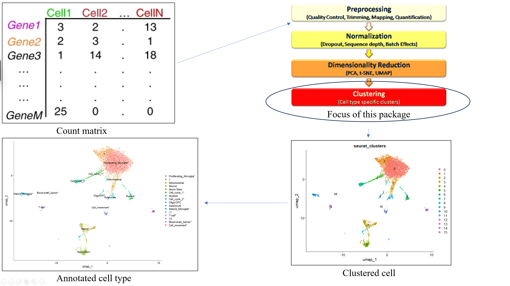

<!-- README.md is generated from README.Rmd. Please edit that file -->

# scClustAnnot

<!-- badges: start -->

<!-- badges: end -->

An R package integrate into [Seurat
V5](https://github.com/satijalab/seurat), meant to aid clustering and
annotation step in scRNA-seq analysis

## Description

`scClustAnnot` is an R package to perform clustering and annotation step
in scRNA-seq work flow. Currently, clustering and annotation in
scRNA-seq analysis requires many repetitive manual works, including
resolution tuning, identifying differentially expressed genes (DEGs),
and interpreting DEGs biological functions at given context, which is
time consuming and subject to researcher’s bias. There exists some
automatic annotation tool, however, mostly done by map to previously
annotated data. In that case, the quality of previously annotated data
is a great concern. This package aims to automate above manual task to
an extent, so that researchers’ bias can be reduced and analysis can be
performed more effectively. The `scClustAnnot` package was developed
using `R version 4.5.0 (2025-04-11 ucrt)`, platform
`Microsoft Windows 11 25H2 (64 bit)`

## Installation

To install the latest version of the package:

``` r
install.packages("devtools")
library("devtools")
devtools::install_github("DDMMMAA/scClustAnnot", build_vignettes = TRUE)
library("scClustAnnot")
```

To run shiny App: Under construction

## Overview

``` r
ls("package:scClustAnnot")
data(package = "scClustAnnot") 
browseVignettes("scClustAnnot")
```

`scClustAnnot` Contains 5 functions.

1.  ***ClusterUnderRes*** for cluster given scRNA-seq data under various
    resolution and generate a cluster tree visualization
2.  ***FindClusterDeg*** for identify cluster specific differential
    expressed genes
3.  ***SinglerAnnote*** for automatically annotate cell by map to
    previously annotated dataset at single cell level
4.  ***ClustifyrAnnote*** for automatically annotate cell by map to
    previously annotated dataset at cluster level
5.  ***ClusterGo*** for conduct GO enrichment analysis among clusters

The package also contains one scRNA-seq data already converted to Seurat
object



## Contributions

This package is an individual project developed and maintained solely by
Jiaqi Ma, contributions include project planing, literature review,
documentation, implementation, etc. The package is heavily based on the
`Seurat` framework. In `ClusterUnderRes()` function `Clustree` were
utilized to generate basic cluster tree. In `SingleRAnnotate()`
function, reference scRNA-seq annotation was accessed via `Celldex` API,
`SingleR` were utilized for mapping query scRNA-seq data to reference
data. In `FindClusterDeg()` funcion, `Seurat::FindAllMarkers()` play the
role of identify cluster specific markers. Development of this package
was assisted by ChatGPT 5, mainly for read error/warning message and
debug. All generated code and documentation were manually reviewed,
refined, and tested by the author before inclusion in the final package.

## References

- 3k PBMCs from a Healthy Donor. (n.d.). 10x Genomics. Retrieved
  November 3, 2025, from
  <https://www.10xgenomics.com/datasets/3-k-pbm-cs-from-a-healthy-donor-1-standard-1-1-0>
- Analysis, visualization, and integration of Visium HD spatial datasets
  with Seurat. (n.d.). Retrieved October 14, 2025, from
  <https://satijalab.org/seurat/articles/pbmc3k_tutorial>
- Aran, D., Looney, A. P., Liu, L., Wu, E., Fong, V., Hsu, A., Chak, S.,
  Naikawadi, R. P., Wolters, P. J., Abate, A. R., Butte, A. J., &
  Bhattacharya, M. (2019). Reference-based analysis of lung single-cell
  sequencing reveals a transitional profibrotic macrophage. Nature
  Immunology, 20(2), 163–172.
  <https://doi.org/10.1038/s41590-018-0276-y>
- OpenAI. ChatGPT (GPT-5.1) \[large language model\]. San Francisco
  (CA): OpenAI; 2025. Available from: <https://chat.openai.com/>
- Fu, R., Gillen, A. E., Sheridan, R. M., Tian, C., Daya, M., Hao, Y.,
  Hesselberth, J. R., & Riemondy, K. A. (2020). clustifyr: An R package
  for automated single-cell RNA sequencing cluster classification.
  F1000Research. <https://doi.org/10.12688/f1000research.22969.2>
- Hao, Y., Stuart, T., Kowalski, M. H., Choudhary, S., Hoffman, P.,
  Hartman, A., Srivastava, A., Molla, G., Madad, S., Fernandez-Granda,
  C., & Satija, R. (2024). Dictionary learning for integrative,
  multimodal and scalable single-cell analysis. Nature Biotechnology,
  42(2), 293–304. <https://doi.org/10.1038/s41587-023-01767-y>
- Ouyang, L., Wu, J., Jiang, X., Almeida, D., Wainwright, C. L.,
  Mishkin, P., Zhang, C., Agarwal, S., Slama, K., Ray, A., Schulman, J.,
  Hilton, J., Kelton, F., Miller, L., Simens, M., Askell, A., Welinder,
  P., Christiano, P., Leike, J., & Lowe, R. (2022). Training language
  models to follow instructions with human feedback
  (No. arXiv:2203.02155). arXiv.
  <https://doi.org/10.48550/arXiv.2203.02155>
- Satijalab/seurat-data. (2025). \[R\]. satijalab.
  <https://github.com/satijalab/seurat-data> (Original work published
  2019)
- Schmiedel, B. J., Singh, D., Madrigal, A., Valdovino-Gonzalez, A. G.,
  White, B. M., Zapardiel-Gonzalo, J., Ha, B., Altay, G., Greenbaum, J.
  A., McVicker, G., Seumois, G., Rao, A., Kronenberg, M., Peters, B., &
  Vijayanand, P. (2018). Impact of Genetic Polymorphisms on Human Immune
  Cell Gene Expression. Cell, 175(6), 1701-1715.e16.
  <https://doi.org/10.1016/j.cell.2018.10.022>
- Wasserstein, R. L., & Lazar, N. A. (2016). The ASA Statement on
  p-Values: Context, Process, and Purpose. The American Statistician,
  70(2), 129–133. <https://doi.org/10.1080/00031305.2016.1154108>
- Wickham, H., Averick, M., Bryan, J., Chang, W., McGowan, L. D.,
  François, R., Grolemund, G., Hayes, A., Henry, L., Hester, J., Kuhn,
  M., Pedersen, T. L., Miller, E., Bache, S. M., Müller, K., Ooms, J.,
  Robinson, D., Seidel, D. P., Spinu, V., … Yutani, H. (2019). Welcome
  to the Tidyverse. Journal of Open Source Software, 4(43), 1686.
  <https://doi.org/10.21105/joss.01686>
- Wu, T., Hu, E., Xu, S., Chen, M., Guo, P., Dai, Z., Feng, T., Zhou,
  L., Tang, W., Zhan, L., Fu, X., Liu, S., Bo, X., & Yu, G. (2021).
  clusterProfiler 4.0: A universal enrichment tool for interpreting
  omics data. The Innovation, 2(3).
  <https://doi.org/10.1016/j.xinn.2021.100141>
- Zappia, L., & Oshlack, A. (2018). Clustering trees: A visualization
  for evaluating clusterings at multiple resolutions. GigaScience, 7(7),
  giy083. <https://doi.org/10.1093/gigascience/giy083>

## Acknowledgements

This package was developed as part of an assessment for 2025 BCB410H:
Applied Bioinformatics course at the University of Toronto, Toronto,
CANADA. `scClustAnnot` welcomes issues, enhancement requests, and other
contributions. To submit an issue, use the GitHub issues.
